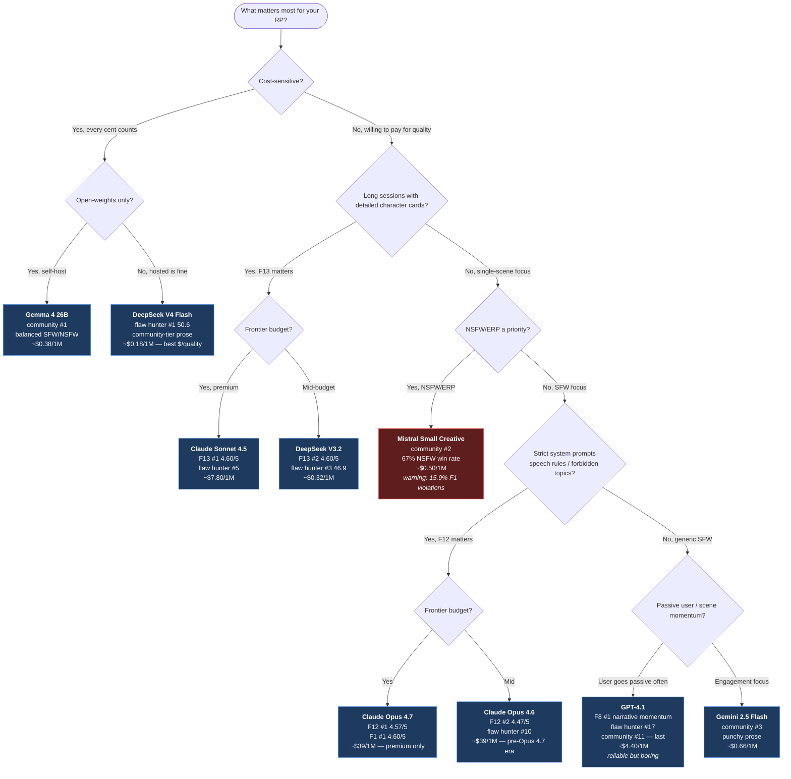

# Pick-a-Model Decision Tree

A flowchart for choosing a model based on what matters to you. Branches use the actual benchmark findings — not vendor marketing.

## Cheat sheet by use case

| If you... | Pick |
|---|---|
| Want **best $/quality** ratio | **DeepSeek V4 Flash** (50.6 flaw hunter / $0.18) |
| Want **best open-weights** for self-host | **Gemma 4 26B** (community #1) |
| Run **long sessions with big cards** (F13) | **Sonnet 4.5** or **DeepSeek V3.2** (tied 4.60) |
| Need **strict prompt compliance** (F12) | **Opus 4.7** (4.57) — Qwen and Llama avoid |
| Run **NSFW / ERP** | **Mistral SC** (67% NSFW win) but expect agency violations |
| Have a **passive user** in scenes (F8) | **GPT-4.1** wins narrative momentum |
| Want **community-favorite engagement** | **Gemma**, **Mistral**, or **Gemini 2.5 Flash** (top-3 community) |
| Care about **prose freshness** (low repetition) | **Grok 4.1** (1.5% bigram repetition vs 9.5% Mistral) |
| **Avoid for RP regardless** | Qwen 3.5 Flash (F1 floor 2.5), Kimi K2.6 (F1 floor 2.5), Llama 4 Maverick (universally weak) |

## Why these specific picks

The decision tree branches on findings, not vendor specs:

- **DeepSeek V4 Flash for cost** because flaw hunter #1 at $0.18/1M (281× more cost-efficient than Opus 4.7 on the same metric).
- **Gemma 4 26B for open-weights** because it held community #1 across all 6 voting snapshots (540 → 2,000 votes).
- **Sonnet 4.5 + DeepSeek V3.2 for big cards** because both tied at 4.60 on F13, every other model trails by ≥0.03.
- **Mistral SC with warning** because community ranks it #2 but our binary detector flagged 15.9% agency violations — popular *because* it leans into your character occasionally.
- **GPT-4.1 for passive scenes** because it's #1 on F8 narrative momentum at 4.30 — but community puts it dead last (#11), so only pick it if you specifically need momentum-on-tap.
- **Avoid Qwen/Kimi K2.6/Llama** because all three have catastrophic floors (≤3.0) on F1 agency in actual sessions — they wrote the user's character at least once.

Don't let one number tell the story. The cards in `results/profile_cards.md` give you everything per model.
